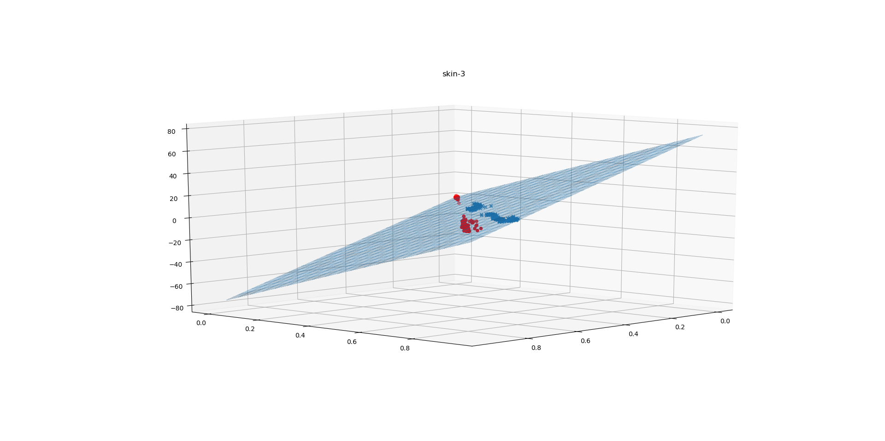

# Assignment 1 Report
### from 1831604 Zhang Yinjia

## 1. Dataset Description

The two datasets selected from UCI  are [IRIS](http://archive.ics.uci.edu/ml/datasets/Iris) and [Skin Segmentation Data Set ](http://archive.ics.uci.edu/ml/datasets/Skin+Segmentation).

The [IRIS](http://archive.ics.uci.edu/ml/datasets/Iris) is a classic dataset with `4` numeric attribute,
,containing 3 classes of 50 instances each, where each class refers to a type of iris plant. In this 
experimtns, I only use 0-th, 2-th and 3-th attributes and two kinds of labels which are 0-Setosa and 1-Not Setosa. 

The [Skin Segmentation Data Set ](http://archive.ics.uci.edu/ml/datasets/Skin+Segmentation) is collected by 
randomly sampling B,G,R values from face images of various age groups (young, middle, and old), race groups 
(white, black, and asian), and genders obtained from FERET database and PAL database. Total learning sample 
size is 245057; out of which 50859 is the skin samples and 194198 is non-skin samples. In this experiment I
retrieve 5000 data points in both two classes.


## Data Preprocessing

### Step1. Max-Min Scale

For both categorical and numeric data, Max-Min Scale is used to restrict values into [0, 1]. The reason is that the ranges of 
numeric data are much different from each other, in this case the initial value of `beta=<W;b>` may inflect the result of 
logistic regression. 

### Step2. Divide Dataset into K Partitons for Cross Validation

To make full use of dataset, k-fold cross validation is used to evaluate accuracy of logistic regression
model. In this experiment, the dataset is divided into 10 partitions. For each partition, the other 
partions are treated as training data and test experiment is processed on this partition. The final 
accuracy is calculated as the average accuracy of all these experiments.

## Modules of Source Code

The code is divided into three parts: `dataprocess.py`, `lr.py` and `experiments.py`

### dataprocess.py

The code in this file is to preprocess the original data into vector data. The main logic of preprocessing
is shown in `Data Description` section. The output of this module is `iris.json` and `skin.json`, whose 
structure is:
```json
 {
     'X_0': [[],[],...],
     'X_1': [[],[],...]
 }
```
The `X_0` is the data whose label is `0` and the `X_1` is the data whose label is `1`.

### lr.py

This module contains the code of logistic regression. The function is organized as class 
LogisticRegression. This class contains two functions: `fit` and
`predict`. `fit` is used to train model using test data. The first part
of `fit` is initialization. The code is shown as follows:
```python
    #init
    X = np.matrix(np.hstack((X, np.ones((X.shape[0],1))))).T # shape: [n_features, n_sample]
    y = np.matrix(y).T # shape: [n_samples, 1]
    d = X.shape[0]
    p_1_func = lambda X, beta: 1/(1+np.exp(-X.T*beta))
    self._beta = np.matrix(np.zeros((d,1))) if self._beta is None else self._beta
    if self._beta.shape[0] != d:
        raise Exception('beta dimension error')
```

X here is the data matrix. First we add `1` to each vector and transform
it into shape [n_features, n_samples]. `y` is the ground truth of data. 
`d` is the dimension of data, which is `n_features`. `p_1_function` is the
lambda function to calculate $\frac{1}{1+e^{-\beta .Tx}}$ for all data 
`X`.

The second part of `fit` is iterations of newton method. The code is as follows:
```python
#newton iteration
    itrs = 0
    while itrs < self._max_itr:
        itrs += 1
        p_1 = p_1_func(X, self._beta)
        df = -1 * X*(y-p_1)
        ddf = np.matrix(np.zeros((d,d)))
        for i in xrange(X.shape[1]):
            ddf += (p_1[i,:]*(1-p_1[i,:]))[0,0] * X[:,i] * X[:,i].T 
        diff = np.linalg.pinv(ddf) * df
        if np.linalg.norm(diff) < self._tol:
            break
        self._beta -= diff
```
`itrs` is the max times of iterations. First the $\frac{1}{1+e^{-\beta .Tx}}$ 
is calculated by `p_1_function`. `df = -1 * X*(y-p_1)` is to calculate 
first derivative of `X` and 
```python
    ddf = np.matrix(np.zeros((d,d)))
    for i in xrange(X.shape[1]):
        ddf += (p_1[i,:]*(1-p_1[i,:]))[0,0] * X[:,i] * X[:,i].T
```
is to calculate second derivative of `X`. The step in newton method is
calculated by `diff = np.linalg.pinv(ddf) * df`. If the matrix `ddf` can
not be inversed, the pseudo inverse matrix of `ddf` is calculated instead.
When the step is less than `self._tol`, the iteration will be interrupted.

The `predict` method is to predict a data record. Before invoking predict,
the `fit` method must be invoked to training the model. It can be chosen 
whether return labels or probilities.

### experiments.py

There are three parts in `experiments.py`. The first part is loading data 
from  json file and scaling data into range [0, 1].  The second part is 
generating k equal partitions of dataset in order to process `k-fold cross validation`.

The third part of this module is running the experiments. To reduce the
impact of initialization of beta, `5` initial betas, one is all-zero and 
others are composed by random values from -2 to +2. For each initial beta,
`5-fold cross validation` is processed. The beta with the best accuracy
is selected as the final beta in model and the average accuracy of this
model is treated as the final accuracy.

## Result Figure

The result in this section comes from processing `predict` on the `5th-fold`
of the partitions using the final beta. In all figures, class information is 
represented by the color of data points, and betas are represented by a 
surface in the space. 

### Iris

> Due to the huge diversity between different classes, the average accuracy
> of `cross validation` is `1.0`, which means that `Logistic Regression` can
> totally classifies the data into two parts correctly. And in the following
> figure, the accuracy is `1.0`, too.


### Skin

> The average accuracy of `cross validation` is `0.992699`, and for `5th-fold`
> of the partitions, its accuracy is `0.989`.  It can be seen that the diversity
> between different classes is not as obvious as that in `Iris`, but the `Logistic Regression`
> can also divide the dataset correctly. In following figures, most of the red data point
> are above of the surface and blue ones are below the surface.




## Improvements

1. When the dataset is high-dimension, dimension reduction such as `PCA` and `LDA` can be introduced into data processing. And it's critical to balance the numer of dimension left and the loss of information during dimension reduction.
2. Sometimes newton method can lead to a local optimization, which may be not acceptable. In this case, we can use some other initial values for target parameters.
3. There may be overfitting in logistic regression. In this case, we can introduce regularization into the loss function.

