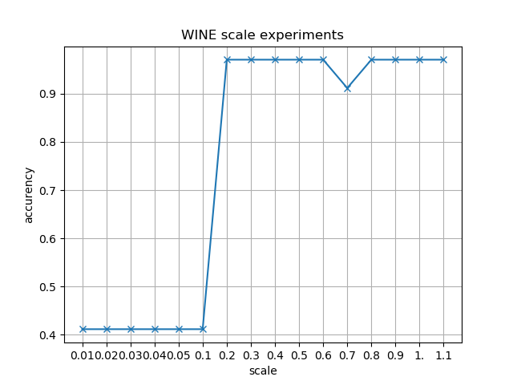

# Assignment 2 Report
### from 1831604 Zhang Yinjia

## Dataset Description

The two datasets selected from UCI  are [IRIS](http://archive.ics.uci.edu/ml/datasets/Iris) and [WINE](https://archive.ics.uci.edu/ml/datasets/Wine).

The [IRIS](http://archive.ics.uci.edu/ml/datasets/Iris) is a classic dataset with `4` numeric attribute,
,containing 3 classes of 50 instances each, where each class refers to a type of iris plant.

The [WINE](https://archive.ics.uci.edu/ml/datasets/Wine) are the results of a chemical analysis of wines grown in the same region in Italy but derived from three different cultivars. The analysis determined the quantities of 13 constituents found in each of the three types of wines. All attributes are continuous.

## Data Preprocessing

### Step1. Max-Min Scale

For both categorical and numeric data, Max-Min Scale is used to restrict values into [0, 1]. The reason is that the ranges of 
numeric data are much different from each other, in this case the initial value of weight matrix `W` and bias `b` may inflect the result of 
logistic regression. 

## Modules of Source Code

There are three source code files in soucecode folder. They are `dataprocess.py`, `full_connected_nn.py` and `experiments.py`.

### dataprocess.py

The code in this file is used to read data from `iris.data` and `wine.data` in dataset folder and dump these data into json format based on their labels.

### full_connected_nn.py

The code in this file implements a fully connetected neural network. Users can pass the structure of neural network and any
activation function they want into this model. In this file, I supply the implements of sigmod function and its derivative function as default activation function. The implements of backpropagation is based on this [tutorial from stanford](http://ufldl.stanford.edu/wiki/index.php/Backpropagation_Algorithm)

The first method is init, as following:

```python
def __init__(self, layer_sizes, activation_func, derivative_func, \
    tol=1e-3, normal_random_scale = 0.5):
        '''
            init function of Fully Connected Neural Network

            @layer_sizes: np.ndarray, shape=(n,) where n>=2
            @active_func: callable, activation function
            @derivative_func: callable, derivative function
            @tol: float, tolerance to stop the gradient descent  
        '''
        self._layer_sizes = layer_sizes
        self._w_mats = [] 
        self._b_mats = []
        self._act_func = activation_func
        self._der_func = derivative_func
        self._tol = tol
        self._fitted = False
        self._normal_random_scale = normal_random_scale
```

The `layer_sizes` is the structure of NN, `active_func` and `derivative_func` are active function and its derivative function. `tol`is the tolerance which is the stop critirion of iterations in backpropagation. `normal_random_scal` is the value of scale in `Normal Distribution` which is used to init the weight matrix. `self._w_mats` is used to store the weight matrixs and `self._b_mats` for bias.

The training method is `fit(self,X,Y, alpha, lamb)`, where `X` is attributes of training data and `Y` is label vectors of `X`. `alpha` is the learning rate and `lamb` is the factors of regularization items.

First, weight matrixs and bias are inititalized by `init` method using `np.random.normal` function. Then the code steps into backpropagation part. 

```python
step_w_mats = [
    np.matrix(np.zeros((self._layer_sizes[i+1], self._layer_sizes[i]))) \ 
    for i in xrange(self._layer_sizes.shape[0]-1)
]
step_b_mats = [
    np.matrix(np.zeros((self._layer_sizes[i+1], 1))) \
     for i in xrange(self._layer_sizes.shape[0]-1)
]
```

`step_w_mats` and `tep_b_mats` are used to store the step of gradient descents. They are both initialized to zero. Then for each records `x` in `X`, backpropagation is processed. The forward part is shown as follows:

```python
z_vecs = [x]
a_vecs = [x]
#forward
for l in xrange(self._layer_sizes.shape[0]-1):
    z_vecs.append(self._w_mats[l]*a_vecs[l]+self._b_mats[l])
    a_vecs.append(self._act_func(np.array(z_vecs[l+1])))
```
`z_vecs` and `a_vecs` stores the inputs and activate values of nerons in layers. The loop above is the forward propagation to evaluate `z_vecs` and `a_vecs`.

```python
#loss
tmp_loss += ((y-a_vecs[-1]).T*(y-a_vecs[-1])/2)[0,0]
#backward
residual_errors = [ np.multiply(self._der_func(z_vecs[-1]), a_vecs[-1]-y) ]
step_w_mats[-1] += residual_errors[-1] * a_vecs[-2].T
step_b_mats[-1] += residual_errors[-1]
for i in xrange(len(self._w_mats)-1, 0, -1):
    re = np.multiply(self._w_mats[i].T * residual_errors[0], \ 
    self._der_func(np.array(z_vecs[i])))
    residual_errors.insert(0, re)
    step_w_mats[i-1] += residual_errors[0] * a_vecs[i-1].T
    step_b_mats[i-1] += residual_errors[0]
```

Above code is the logic of backward propagation. Here residual error matrixs are calculated based on that of the next layer. Details of algorithm and provement can be found in [http://ufldl.stanford.edu/wiki/index.php/Backpropagation_Algorithm](http://ufldl.stanford.edu/wiki/index.php/Backpropagation_Algorithm).

The follwing code updates the weight matrix and bias vectors, and decided whether to stop the iterations.

```python
for i in xrange(len(self._w_mats)):
    self._w_mats[i] -= alpha*( step_w_mats[i]/X.shape[1] \ 
    + lamb*self._w_mats[i] )
    self._b_mats[i] -= alpha*( step_b_mats[i]/X.shape[1] )
#check whether to stop the iteration
if np.abs(last_loss-tmp_loss) <= self._tol:
    break
else:
    last_loss = tmp_loss
```
And the `predict(self, X)` method is for predictions. Its logic is as same as that of forward propagation in `fit` method. 

### experiments.py

Experiments code is in this file. Experiments in different `scale`, `tol`, `learning_rate` and `lambda`, which is the factor of regularization items.

## Result Figure

In the experiments, I try to find out relations between `scale`, `torlerance`, `learning rate`, `facotrs of regularizations`, `structures`  and accurency. The following figures are the results of these experiments.

#### learning rate

In learning rate experiments, tolerance is 0.01, scale is 0.4 and the facotr of regularization item is 0.


Observing above figures, it can be seen that with the increasement of learning rate, accurency goes up, too.
That maybe because when the learing rate is small, the gradient descent reached a local optimization. When learning
rate becomed bigger, the iterations jump out of the local optimizations and reached the global optimization.

#### tolerance

In tolerance experiments, learning rate is 0.9, scale is 0.4 and the facotr of regularization item is 0.


Accurencies in two figures both go down with the increasement of tolerance, which means that a result with big tolerance
may not be a best result. In the another hand, though a small tolerance can lead to a better result, it will make the convergence too time-consuming.

#### scale

In scale experiments, learning rate is 0.9, tolerance is 0.01 and the facotr of regularization item is 0.




A bigger scale leads to a better result in both figures. I guess that's because when the initializations are too close
to zero, iterations will goto a local optimization.

#### factors of regularization items

In scale experiments, learning rate is 0.9, tolerance is 0.01 and scale is 0.4 .


Regularization items are used to prevent overfitting. Due to the data sizes of IRIS and WINE are both small, so their is
little chance to overfit when training. So a higher factor leads to a worse accurency.

#### hidden layer sizes

In this part of experiments, learning rate is 0.9, tolerance is 0.01, scale is 0.4 and factor of regularization item is 0.
There is only one hidden layers. Note the size of attributes as `A`, the size of the hidden layers begins at `A-2` and ends at `A+5`.


The size of IRIS attributes is 4. When the hidden layer size is 2, the accurency of left figure is around 0.3, which is pretty low. With the increasement of size, the accurency goes up sharply. For WINE dataset, the accurency is always high.
It's obvious that a too small hidden layer size can not meet the requirements, but it do not need to be too large.

#### numbers of hidden layers

In this part of experiments, learning rate is 0.9, tolerance is 0.01, scale is 0.4 and factor of regularization item is 0.
There is only one hidden layers. Note the size of attributes as `A`, the sizes of the hidden layers are `A+2`. The numbers of hidden layers begins at 1 and ends at 3


Above results show that the accurencies go down with the increasement of hidden layers' number. So it is not true that the more hidden layers can lead to better results. 

## Improvements

1. In this experiment, the activation function is sigmod function. More activation functions can be tested.
2. The attributes of IRIS and WINE are small. More datasets with high dimensions can be introduced into experiments.
3. The accurencies are calculated with the test data which is the same part of the whole dataset. K-folder cross validation can be processed.

