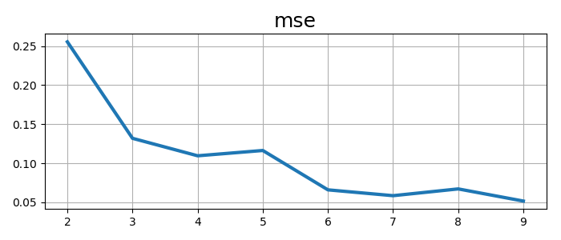
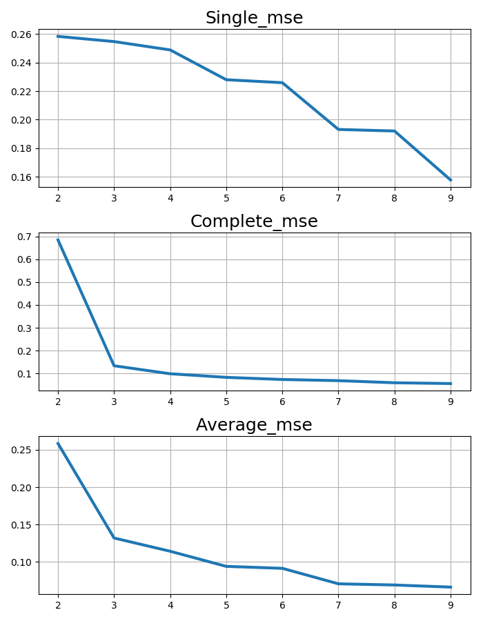

# Assignment 3 Report
### from 1831604 Zhang Yinjia

## Dataset Description

The two datasets selected from UCI  are [IRIS](http://archive.ics.uci.edu/ml/datasets/Iris) and [WINE](https://archive.ics.uci.edu/ml/datasets/Wine).

The [IRIS](http://archive.ics.uci.edu/ml/datasets/Iris) is a classic dataset with `4` numeric attribute,
,containing 3 classes of 50 instances each, where each class refers to a type of iris plant.

The [WINE](https://archive.ics.uci.edu/ml/datasets/Wine) are the results of a chemical analysis of wines grown in the same region in Italy but derived from three different cultivars. The analysis determined the quantities of 13 constituents found in each of the three types of wines. All attributes are continuous.

## Modules of Source Code

there are 4 files in `sourcecode` folder, they are `hac.py`, `kmeans.py`, `experiments.py` and `figure.py`

### hac.py

In `hac.py`, there is code which implementing the `Hierarchical Clustering` algorithm. There are two classes in
this file. The first one is `Cluster`. It is used to represent a cluster in the algorithm. It stores object members
and their indexes in the dataset. And another class is `Hierarchical`. It supplies a `fit` method to process the 
clustering algotithm. Its code is as follows:

```python
        if type(X) != np.ndarray:
            raise Exception('X not a numpy.ndarray')

        clus = [ Cluster((X[i],i)) for i in xrange(X.shape[0])]
        adj_mat = np.matrix(np.zeros((X.shape[0], X.shape[0])))

        #initialize adjacent matrix
        for i in xrange(len(clus)):
            for j in xrange(i, len(clus)):
                dist = linkage(clus[i], clus[j]) if i!=j else float('inf')
                adj_mat[i,j] = adj_mat[j,i] = dist
        
        #run merge
        while True:
            min_dist = adj_mat.min()
            min_loc = np.where(adj_mat == min_dist)
            x = min_loc[0][0]
            y = min_loc[1][0]
            clus_1 = clus[x]
            clus_2 = clus[y]
            clus_1.merge(clus_2)
            clus.remove(clus_2)
            # delete min_loc[1]-th row and col
            adj_mat = np.delete(adj_mat, y, axis=0)
            adj_mat = np.delete(adj_mat, y, axis=1)

            for i in xrange(len(clus)):
                dist = linkage(clus[i], clus_1) if i!= x else float('inf')
                adj_mat[i, x] = dist
                adj_mat[x, i] = dist
            if len(clus) == k:
                break
        
        #return label
        y_predict = np.array([-1 for i in xrange(X.shape[0])])
        for i, c in enumerate(clus):
            for l in c.mem_idx:
                y_predict[l] = i
        return y_predict
```
After checking the data type of `X`, I initialized the adjacent matrix first. If `i==j`, I give infinity to 
the position. Although it should be `0`, doing so is convenient for finding minimum distance in adjacent matrix later.
Then in the `while` loop, I firstly find the minimum distance using the `min()` function supplied by `numpy`, and using
`numpy.where` to find the corresponding clusters. Then, the two clusters are merged into one and the columns and row
of one cluster is removed from adjacent matrix. After that, the new distance between the new cluster and other clusters
are calculated and the matrix is updated. If the number of leaving clusters is equal to `k`, the loop will end and the 
method return the result; If not, the loop will go on.
Then, I supply three kinds of linkage in this file. They are `Single Linkage`, `Complete Linkage` and `Average Linkage`.

### kmeans.py

In this file, I supply the implementation of `K-Means` algorithm. There is only on class named `KMeans` in this file.
The code is as follows:
```python
class KMeans:

    def fit(self, X, k):
        '''
            KMeans on X, dividing into k clusters

            @X: np.ndarray; shape = [n_samples, n_features]
            @k: int

            #return: np.ndarray, shape = [n_samples,]
        '''
        centers = random.sample(X,k)
        y_predict = np.array([-1 for i in xrange(X.shape[0])])

        while True:
            cls_mean = np.array([ [0. for j in xrange(X.shape[1])] for i in xrange(k)])
            cls_count = np.array([0 for i in xrange(k)])
            for i, v in enumerate(X):
                # find the nearest center
                nrst_ctr = 0
                for j, c in enumerate(centers):
                    if np.sum(np.sqrt((v-c)**2)) < np.sum(np.sqrt((v-centers[nrst_ctr])**2)):
                        nrst_ctr = j
                # update y_predict, cls_mean and cls_count
                y_predict[i] = nrst_ctr
                cls_mean[nrst_ctr] += v
                cls_count[nrst_ctr] += 1
            for d in xrange(X.shape[1]):
                cls_mean[:, d] /= cls_count
            
            if np.sum(centers==cls_mean) == cls_mean.shape[0] * cls_mean.shape[1]:
                break
            else:
                centers = cls_mean

        return y_predict
```

The only method of `KMeans` is `fit`. At first, I sample `k` data points from dataset as initial centers randomly.
Then the iteration begins. `cls_mean` is used to store the mean of clusters in this iteration. And `cls_count` records
the number of data points in each cluster. After traversing all nodes in dataset, means are calculated by `cls_mean/cls_count`.
If all centers are steady, which means `centers==cls_means`, the iteration will be broken, else the loop will go on.

### experiments.py

This file supplies the experiments code. First it reads data from json file. Then, for `KMeans`, I set `k` from `2` to `9` and
run the algorithm. Then indexes are calculated. For `Hierarchical Clustering`, `k` is set from `2` to `9`, too. Then with
three kinds of linkage, the algorithm are processed. All results are ouputted to json files.

### figure.py

In this file, I draw results plots.

## Experiment Results

### IRIS:

The following figures show the `mse(mean squared error)` of clustering results. The first figre is using `KMeans` and `Hierarchical Clustering` is emploied in the second figure. 

#### Kmeans


#### Hierarchical


As we know, the `IRIS` dataset is composed by three clusters. `mse` in `KMeans`, `Hierarchical with CompleteLinkage` and
`Hierarchical with AverageLinkage` show knee point at `k=3`. But `Hierarchical with SingleLinkage` does not show the 
knee point at `k=3`.

### WINE

The logic of following two figures is same as those in `IRIS` dataset.

#### Kmeans


#### Hierarchical


There are three clusters in the `WINE`, too. We can see `Hierarchical with SingleLinkage` does
not show a knee point , either. Knee points appears in all the other plots, and the most obvious knee point shows in `Hierarchical with CompleteLinkage`.

Based on the above results, we can see that both `KMeans` and `Hierarchical` can find the proper distribution 
of dataset. However, the result of `SingleLinkage` is not good. I think that because it take the minimun distance
between clusters, and that may be effected by extreme data points easily.

## Improvement

1. In `Hierarchical Clustering`, it takes `O(n^2)` to find the minimum distance in adjacent matrix. However, if `heap` is used to store the distances, the time cost can be reduced to `O(nlogn)`.
2. In `KMeans` algorithm, the results can be effected easily by dirty data points. We can use `K-Medoids` to replace it. Instead of calculating means of clusters, the point with minimun sum with other points in a same cluster is selected as the center the of cluster. This method is not sensitive to dirty data. However, the time efficiency of this algorithm is worse than `KMeans`