## 3. Structure/Workflow: Theory of Deep Subspace Clustering Network

Deep subspace clustering is composed by three parts: spectral clustering, self-expressiveness and autoencoder.

### 3.1 Spectral Clustering

Spectral clustering algorithm is based on Laplacian Eigenmaps. Given a set of data points $x_1$, . . . $x_n$ and some notion of similarity s >= 0 between all pairs of data points $x_i$ and $x_j$ , the goal of clustering is to divide the data points into several groups such that points in the same group are similar and points in different groups are dissimilar to each other. In spectral clustering, data points are represented by a graph $G(V,E)$, where $V$ is the entire set of vertexes(a vertex is a data point) and $E$ is the set of edges between vertexes. Weights of edges can be presented by similarities between data points. The algorithm is to cut the graph into several sub-graphs such that the edges between different sub-graphs have low weights (points in different clusters are dissimilar from each other) and the edges within a group have high weights (points in the same cluster are similar to each other).

The algorithm cuts the graph using Laplacian Matrix, which is defined as :

$L=D-W$

where $D$ is is diagonal weight matrix and $W$ is weight matrix. The diagonal elements of $D$ is the sum of weights in their rows(or column) in $W$, that is:

$D_{ii} = \Sigma_{j} W_{ij}$

Given laplacian matrix $L$, the spectral clustering can be processed by following steps:

1. Compute the first k-smallest eigenvectors $u_1$, $u_2$, ..., $u_k$ of $L$
2. Let $U\in R^{n\times k}$ be the matrix containing the vectors $u_1$, $u_2$, ..., $u_k$ as columns.
3. For $i=1,..,n$, let $y_i\in R^{k}$ be the vector corresponding to the $i-th$ row of $U$.
4. Clusters the points $(y_i)_{i=1,...,n}$ in $R^{k}$ with the $k-means$ algorithm or using discrete method into $C_{1},...,C_{k}$

The intuition of spectral clustering is to map the data points to low-dimension subspaces. The relative similarities between data points in subspaces are similar to which in original spaces. Actually, given a laplacian matrix, $y^{T}Ly$ can be infered to $\Sigma_{i,j}w_{i,j}\parallel y_i - y_j \parallel^2$. Here $\parallel y_i - y_j \parallel^2$ is the distance between $i_{th}\ point$ and $j_{th}\ point$ in subspaces, and the $w_{i,j}$ is a penalty item. Given a $L$, we can minimize $y^{T}Ly$ to get the mapping which keeps the relative similarities between data points in original space. We can use the theory of rayleigh quotient to solove this problem because $L$ is a symmetric matrix. And that is why we compute the k-smallest eigenvectors of $L$.

### 3.2 Self-Expressiveness

The intuition of self-expressiveness is that a data point can be represented as the linear combination of all the other data points. It can be represented by $X=XC$ where $C$ is the self-representation coefficient matrix and $diag(C)=0$. To make this representation tight, the current data point should only use the points in the same subspace, that is to say in the same cluster. It can be achieved by minimize the $\parallel C \parallel_{p}\ s.t X=XC,\ diag{C}=0$, where $\parallel.\parallel_{p}$ is a arbitrary matrix norm. When noise is not considered, it has been proven that if we permute orders of elements in $C$ based on their clusters, the solution of minimization is block-diagonal with non-zero blocks corresponding to points in the same subspaces. 

It can be observed that the $C$ can be the $W$ in spectral clustering. Coefficients between points in the same cluster are bigger than that between point in different clusters. However, the self-expressiveness property only holds for linear subspaces. The traditional way of non-linear mapping is kernal based method. But the pre-defined kernel functions usually not suit the distribution well. So Pan Ji et al. proposed $Deep\ Subspace\ Clustering\ Networks$, which uses AutoEncoder to learn a more efficient mapping.

### 3.3 Architecture of Auto-Encoders

The traditional auto-encoders has the architecture as follows:

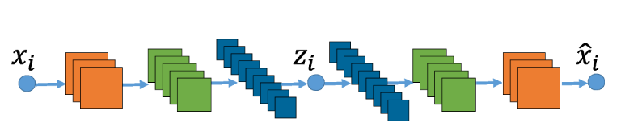

The input $x_i$ is mapped to $z_i$ through an encoder, and then reconstructed as $\hat{x_{i}}$ through a decoder. By this way, we can achieve the target of feature retrievement or dimension reduction. In this paper, author introduced a new layer that encodes the notion of self-expressiveness. The output of encoder is not treated as the input of the decoder directly but goes through a new self-expressiveness layer. The proposed architecture is:

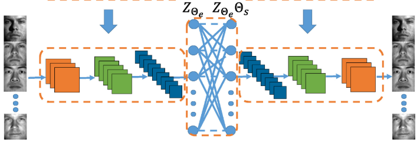

The output of encoder $Z_{\Theta_{e}}$ multiplies the coefficient matrix $\Theta_{S}$ by goes through the self-expressiveness layer. And decoder takes $Z_{\Theta_{e}}\Theta_{S}$ as input. To encode self-expressiveness, the author introduced a new loss function defined as:

$L(\Theta, C)=\frac{1}{2}\parallel X-\hat{X}_{\Theta}\parallel^2_{F}+\lambda_{1}\parallel C\parallel_{p} + \frac{\lambda_2}{2}\parallel Z_{\Sigma_e}-Z_{\Sigma_e}C\parallel^2_F \ s.t.\ diag(C)=0$

where $\hat{X}_{\Theta}$ represents the data reconstructed by the auto-encoder. The second term of loss function is to find the tightest mapping and the third is to guarantee the self-expressiveness property of the new layer.  $C$ is treated as the parameters of an additional network layer noted by $$, which lets us solve for $C$ using backpropagation.

## 4. Performance

### 4.1 Source Code Structure

To recurrence the method proposed in paper, we divided the source code into three main parts: <font color='blue'>DSC_Net.py</font>, <font color='blue'>experiments.py</font> and <font color='blue'>EncDec</font>. The structure of source code is as follows:

```
.
├── data_process.py
├── DSC_Net.py
├── EncDec
│   ├── __init__.py
|   ├── Conv_EncDec.py
│   ├── Fully_Connected_EncDec.py
│   └── NLayerConv_EncDec.py
└── experiments.py

```

In first module <font color='blue'>DSC_Net.py</font>, we implemented the general architecture of DSC network. In this script, we define a class named <font color='blue'>DSC_Net</font>， it takes two functions which can generate encoder and decoder respectively and some others  as initial parameters. In <font color='blue'>__init__</font> method of <font color='blue'>DSC_Net</font>, encoder generator is invoked and the output of encoder is multiplied to a coefficient matrix. Then the result is taken as the input of decoder which is the return of decoder generator. And the loss of all parts is summarized by tensorflow. In <font color='blue'>train</font> method, a tensorflow session is actived and run the calculation tasks. The coefficient matrix and loss of each part are returned.

In second module <font color='blue'>EncDec</font>, three kinds of encoder/decoder architectures are implemented. In <font color='blue'>Conv_EncDec.py</font>, a recurrence of single convolutional layer in the paper is provided. We further extended the single convolutional layer with a fully connected layer in <font color='blue'>Fully_Connected_EncDec.py</font>. And last an convolutional architecture whose layers and kernals can be specified by users is implemented  <font color='blue'>NLayerConv_EncDec.py</font>.

In third module <font color='blue'>experiments.py</font>, we give the code of experiments under three kinds of architectures, and print the loss of each parts and the final accurency rate to the terminal. 

### 4.2 Experiments

In this section, we give results of experiments. Due to the memory limitation of our equipments, we use the <font color='blue'>COIL-20(Columbia University Image Library)</font> dataset. It contains 1440 pictures of 20 objects(72 pictures for each oject). Our experiments are composed by two parts: one is to verify the accurency of our recurrence, and another is to check the effect of other architectures.

#### 4.2.1 Recurrence

In recurrence experiment, we use the same network, <font color='blue'>a single convolutional layer</font>, as the encoder and decoder and the same dataset is employed in both versions. The results of two implements are quite similar. The code provided by authors had the accurency of <font color='red'>0.8548(best):0.6989(worst)</font>, and the accurency of our implement is <font color='red'>0.8132(best):0.7127(worst)</font>. The results are evaluted with the same parameters. The trend of total loss and its items are shown.

##### Author's Implement
$L(\Theta, C)$  | $\parallel X-\hat{X}_{\Theta}\parallel^2_{F}$ | $\parallel C\parallel_{p}$ | $\parallel Z_{\Sigma_e}-Z_{\Sigma_e}C\parallel^2_F$
:-:|:-:|:-:|:-:
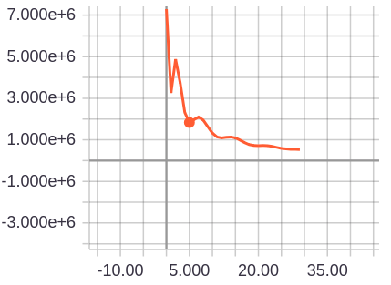|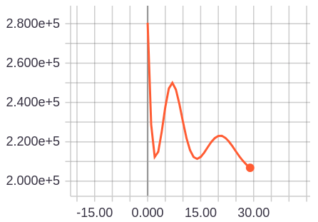 | 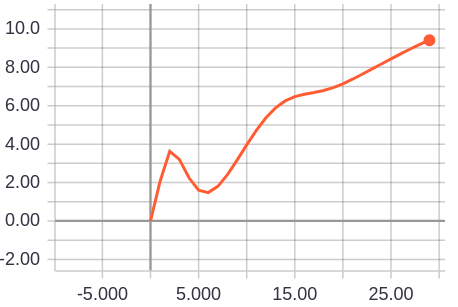 | 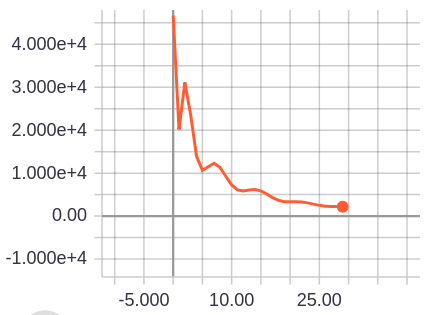

##### Our Implement
$L(\Theta, C)$  | $\parallel X-\hat{X}_{\Theta}\parallel^2_{F}$ | $\parallel C\parallel_{p}$ | $\parallel Z_{\Sigma_e}-Z_{\Sigma_e}C\parallel^2_F$
:-:|:-:|:-:|:-:
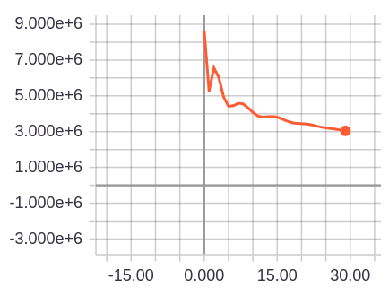|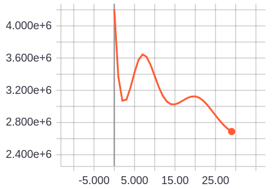 | 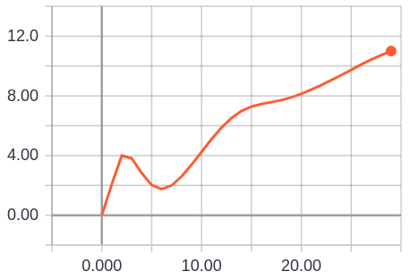 | 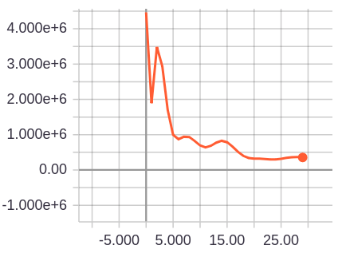

Two following pictures are the computation graphs generated by tensorflow.

##### Author's Implement
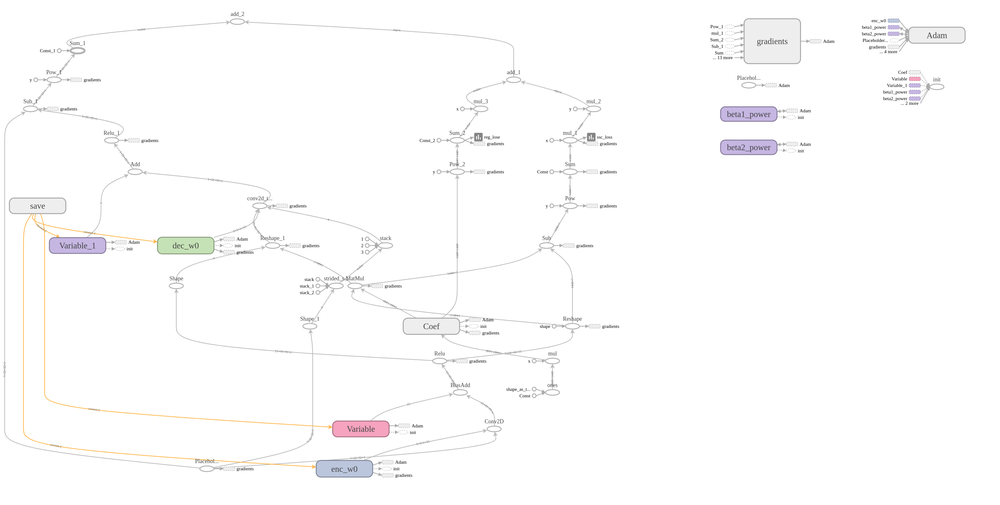

<br><br><br><br>
##### Our Implement
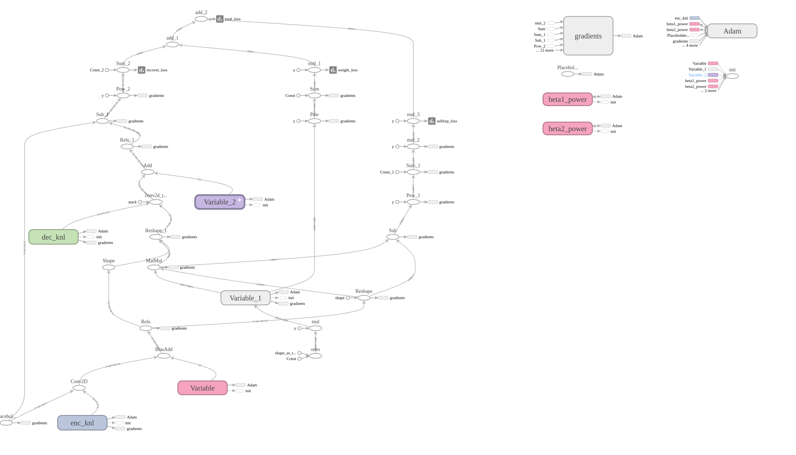

It can be seen that the curves in author's implement and our implements are similar. Although the value of items are not quite different, the accurencies of both version are in similar range. What is more is that two computation graphs own the similar structure<strong>(They look different because details of implements are different)</strong>. So it is confident to say that our recurrence is accurate. 

#### 4.2.2 Extension

In this section, we give the results of other three architectures. They are <font color='blue'>2-convolutional-layers</font>, <font color='blue'>3-convolutional-layers</font> and <font color='blue'>(1-convolutional-layer)+(1-fully-connected_layer)</font>. The following table shows theri accurencies:

##### Accurency
2-convolutional-layers|3-convolutional-layers|(1-convolutional-layer)+(1-fully-connected_layer)
:-:|:-:|:-:
0.7591|0.71458|0.525

It can be seen that <font color='blue'>2-convolutional-layers</font> and <font color='blue'>3-convolutional-layers</font> share similar accurencies, but they are both worse than <font color='blue'>1-convolutional-layers</font>. And the accurency of <font color='blue'>(1-convolutional-layer)+(1-fully-connected_layer)</font> is much more lower than the others. For three kinds of architectures, we give their trends of total loss as follows.

<br><br><br><br><br>
##### Total Loss Curves
2-convolutional-layers|3-convolutional-layers|(1-convolutional-layer)+(1-fully-connected_layer)
:-:|:-:|:-:
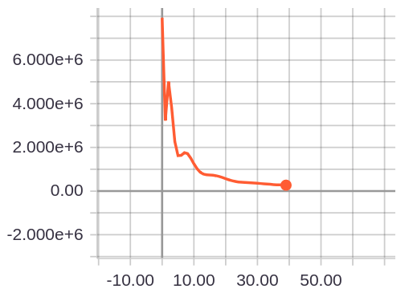|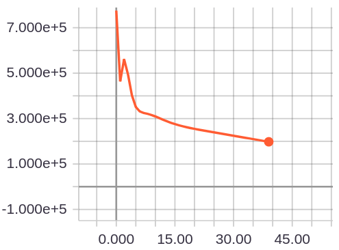|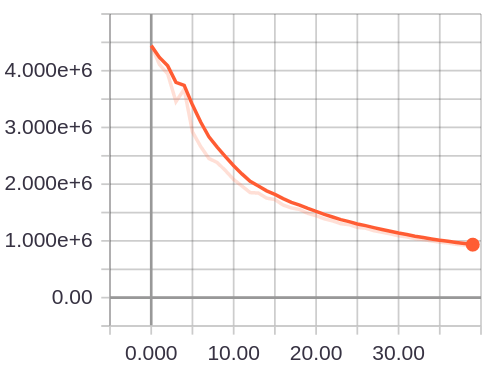

We can see the trends of <font color='blue'>2-convolutional-layers</font> and <font color='blue'>3-convolutional-layers</font> are similar, but that of <font color='blue'>(1-convolutional-layer)+(1-fully-connected_layer)</font> is more smooth than the others.

At last, we give the computation graphs of three arichitectures.

##### 2-convolutional-layers
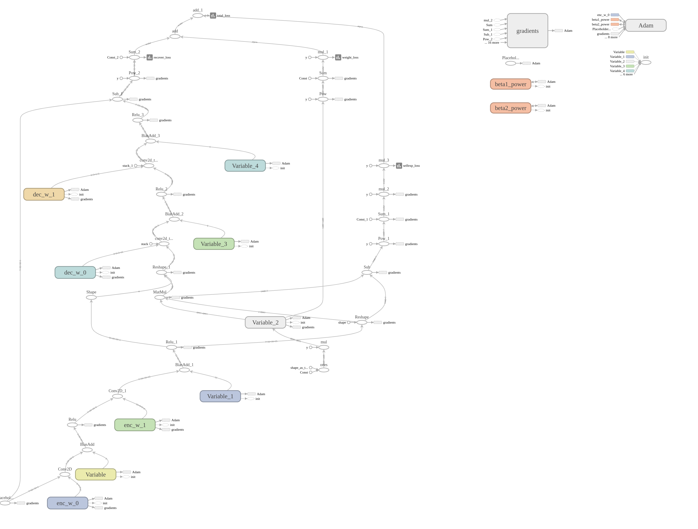

<br><br><br><br><br><br>
##### 3-convolutional-layers
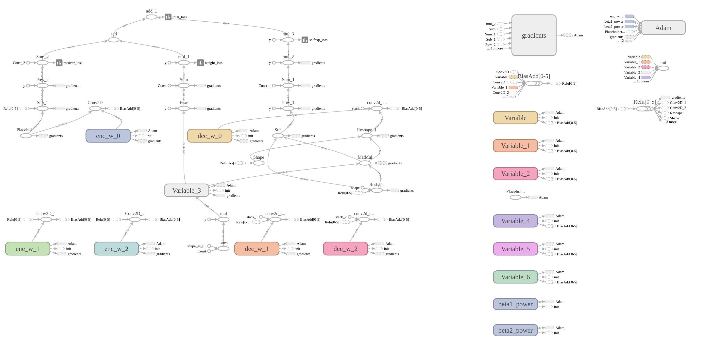


##### (1-convolutional-layer)+(1-fully-connected_layer)
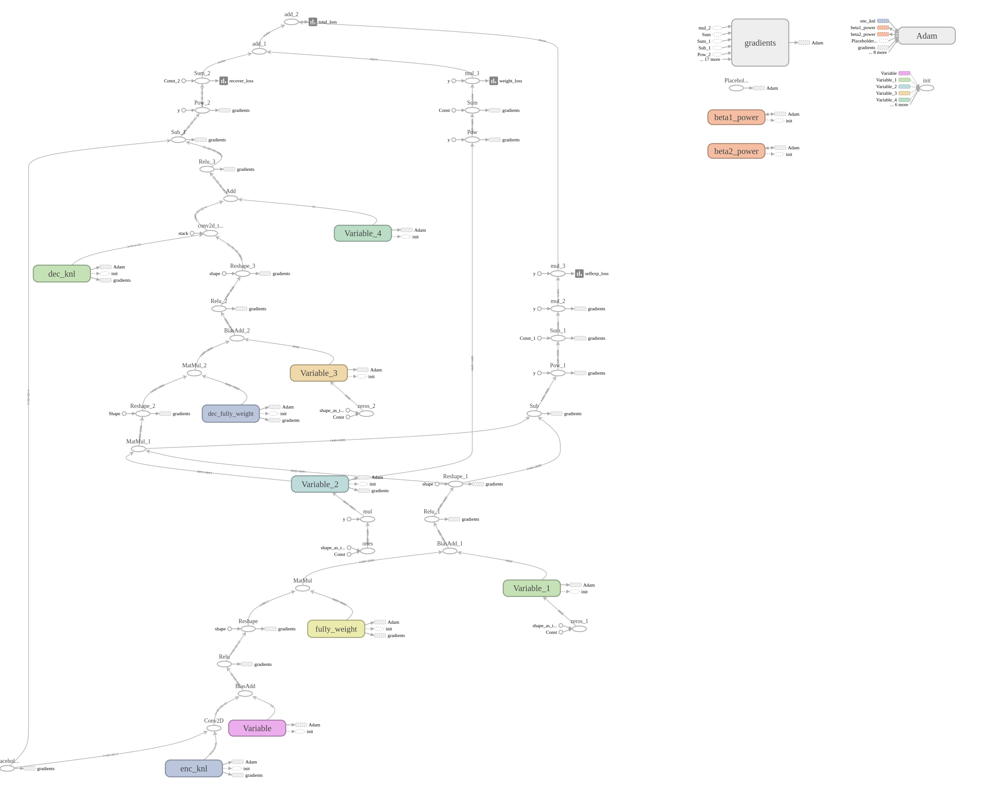


## 5. Discussion

In this section, we discuss the results of out recurrence.

#### 5.1 Strength of Deep Subspace Clustering Network

In tradition, the weight matrix in spectral clustering is hard to generate. Developers must choose many kinds of kernal methods until they find the best one. In this paper, the authors proposed a novel method using AutoEncoder to automatically learn a weight matrix. Inspired by self-expressiveness, they added a self-expressiveness layer between encoder and decoder and take the weights of the new layer to generate a weight matrix for spectral clustering. What's more is that it can solve the problem that traditional self-expressiveness methods only hold for linear mappings. Beside saving the developers from choosing proper kernal methods, another strength of this method is its flexibility. Theoretically， we can choose arbitrary network arichitectures to compose the encoder and decoder, which supplies huge scalability and possibility in applications. 

#### 5.2 Defect of Deep Subspace Clustering Network

Although the idea of this paper is very novel and enlightening, there are still some defects. First, the parameters of the network is enormous. Suppose the size of dataset is $N$, the coefficient matrix's size is $N \times N$. With the growth of data size, the number of parameters grows rapidly, which requires huge memory resource. Second, the accurency of the network is not as good as that declared in the paper. In the paper, it is shown that the accurency can achieve $95\%$. However, we find the accurency is between $70\%$ and $85\%$ in most cases even using the authors' implements. And the performance is not stable. We thought it may be related to the method of initialization. Due to the limitation of time, we did not dig into this problem. Third, there is no instructions of how to choose a proper encoder/decoder. From the experiments in section 4.2.2, it can be seen that we could not get a improvements on performance with the increasement of layers. And all hidden layers in the paper are convolutional layers, the performance drops when we added a fully connnected layer after the single convolutional layers. And there is not related content in the paper.

